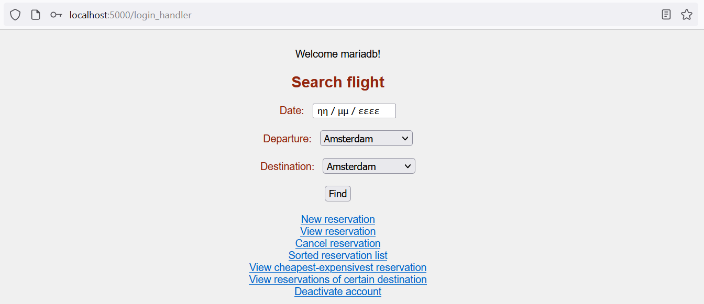
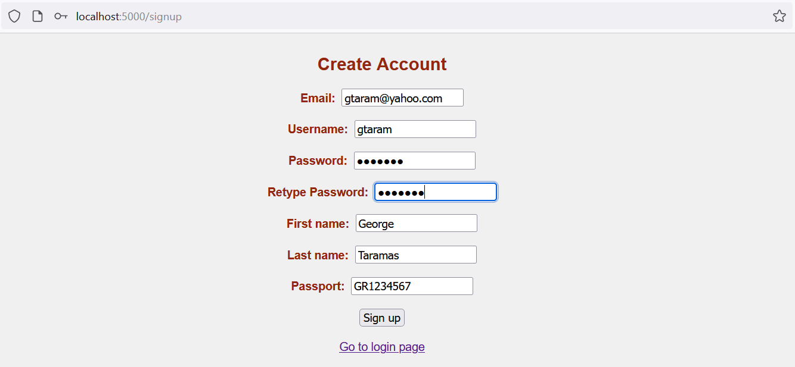
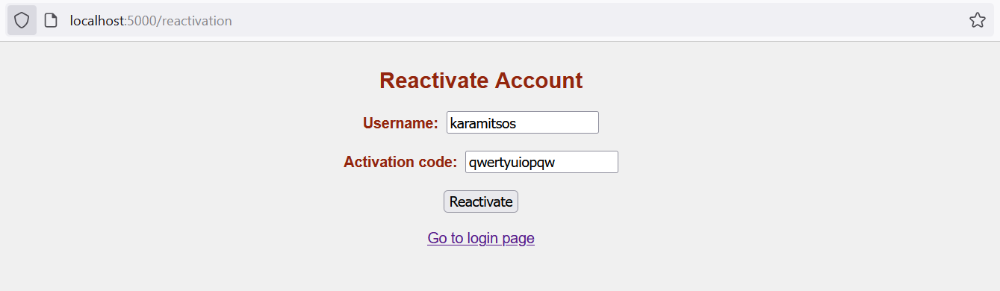
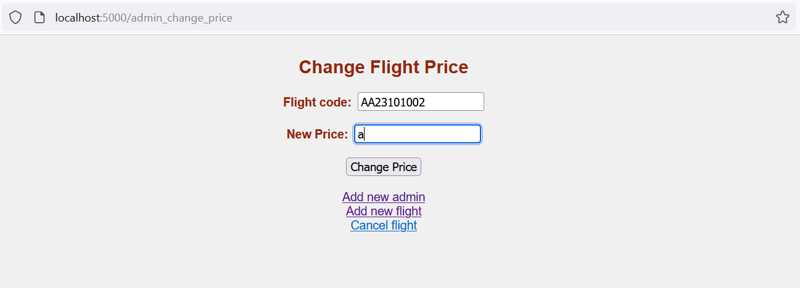
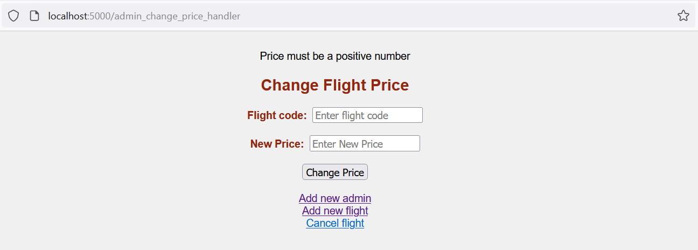

# Εργασια Πληροφοριακων Συστηματων

Η εργασία υλοποιεί επιτυχώς όλα τα ζητούμενα.
Προκειμένου να την εκτελέσει κάποιος στον υπολογιστή του, μπορεί (όπως υποδεικνύεται και από την εκφώνηση και τη δουλειά στα εργαστήρια) να κατεβάσει και να εγκαταστήσει τα εξής:

1. Έναν browser.
2. Τον διερμηνευτή της γλώσσας Python, κατά προτίμηση κάποια version 3.
3. Προαιρετικά το εργαλείο ανοιχτού κώδικα Microsoft Visual Studio Code.
4. Την πλατφόρμα Docker.
5. Την MongoDB.
6. Το εργαλείο Flask στην Python.
7. Τη βιβλιοθήκη pymongo στην Python.

Πριν εκτελέσουμε την εφαρμογή μας θα πρέπει ο server θα πρέπει να τρέχει η Mongo DB στο σύστημά μας και επιπλέον να υπάρχει η βάση DBAirlines. Η θύρα που έχουμε επιλέξει είναι η προεπιλεγμένη δηλαδή η 27017. \
Μπορούμε να δημιουργήσουμε τη βάση DBAirlines εκτελώντας σε περιβάλλον windows στο powershell την εντολή:**docker exec -it mongodb mongo** \
Αν χρησιμοποιούμε linux θα πρέπει να την εκτελέσουμε με sudo. Η εντολή αυτή ανοίγει τη γραμμή εντολών της mongo. Σε αυτήν μπορούμε να πληκτρολογήσουμε:
**use DBAirlines** \
Βγαίνουμε από τη γραμμή εντολών της mongo και επιστρέφουμε στο powershell με την εντολή:**exit** \
Να σημειώσουμε ότι για να υπάρχουν κάποια αρχικά δεδομένα και κυρίως ένας
διαχειριστής (χωρίς αυτόν δεν μπορεί να υπάρχουν άλλοι διαχειριστές) παραθέτουμε και τρία json αρχεία τα οποία βρίσκονται στον ίδιο κατάλογο με το app.py. \
Τα δύο αυτά json αρχεία είναι τα εξής:
1. Το αρχείο users.json το οποίο περιέχει ένα διαχειριστή και δύο απλούς χρήστες σε json μορφή.
2. Το αρχείο flights.json το οποίο περιέχει τέσσερις πτήσεις σε json μορφή.
3. Το αρχείο reservations.json το οποίο περιέχει τρεις κρατήσεις σε json μορφή.
Μπορούμε να εισάγουμε τα δεδομένα αυτά στη βάση μας (ειδικά για τους χρήστες είναι απαραίτητο αφού περιέχεται ο πρώτος διαχειριστής) από την γραμμή εντολών powershell σε περιβάλλον windows ως εξής:
* docker cp users.json mongodb:/users.json
* docker exec -it mongodb mongoimport --db=DSAirlines --collection=users --file=users.json -- jsonArray
* docker cp flights.json mongodb:/ flights.json
* docker exec -it mongodb mongoimport --db=DSAirlines --collection=users --file= flights.json - -jsonArray
* docker cp reservations.json mongodb:/ reservations.json
* docker exec -it mongodb mongoimport --db=DSAirlines --collection=users --file= reservations.json --jsonArray
Σημειώνουμε ότι σε linux πάλι οι εντολές τρέχουν με sudo. \
Σαφώς η mongo και η python εφαρμογή μας τρέχει σε διαφορετικά containers του docker όπως ακριβώς έχει ζητηθεί. Γα τον λόγο αυτό έχουμε δημιουργήσει το **docker-compose.yml** το οποίο θα συνδέει τα δύο container. \
Η ίδια η εφαρμογή μας τρέχει στη θύρα 5000. Αφού έχουμε εκκινήσει την Mongo DB
μπορούμε να τρέξουμε την εφαρμογή μας από τη γραμμή εντολών πληκτρολογώντας
python app.py αφού πρωτίστως έχουμε μεταβεί στον κατάλογο που περιέχει την εφαρμογή μας.\
Σημειώνουμε ότι ο κατάλογος templates περιέχει html αρχεία τα οποία αντιστοιχούν στις υπηρεσίες και τα οποία επικοινωνούν με flask με την εφαρμογή μας.Το layout.html\
χρησιμοποιείται για να δώσει ένα ενιαίο css στα υπόλοιπα.
Ο χρήστης συνδέεται στην αρχική σελίδα της εφαρμογής με έναν απλό browser (το
endpoint βρίσκεται στη διεύθυνση http://localhost:5000/) και μπορεί να κάνει ένα από τα
εξής:
1. Να συνδεθεί (login) στο σύστημα είτε σαν admin είτε σαν απλός χρήστης.
2. Να κάνει εγγραφή (sign-up) στο σύστημα δηλαδή να δημιουργήσει νέο λογαριασμό
3. Να ενεργοποιήσει νέου τον λογαριασμό του στην περίπτωση που προηγουμένως τον
είχε απενεργοποιήσει.

Ακολουθούν παραδείγματα επιτυχούς σύνδεσης για χρήστη και για admin. Αρχικά
βλέπουμε επιτυχή σύνδεση σε επίπεδο χρήστη.

Εδώ βλέπουμε επιτυχή σύνδεση σε επίπεδο admin.

Παρακατω βλεπουμε παραδειγμα αποτυχημενης προσπαθειας συνδεσης.

Στην περίπτωση της σύνδεσης, τα πεδία που πρέπει να πληκτρολογήσει ο χρήστης είναι υποχρεωτικά. Ο handler που αναλαμβάνει την εξυπηρέτηση της φόρμας ελέγχει εάν ο συνδυασμός username – password υπαρχει αποθηκευμενος στη βαση (και συγκεκριμενα στο collection users).Εναλλακτικα ελεγχει και αν ο συνδυασμος μειλ-κωδδικου υπαρχει στη βαση, ετσι ωστε να μπορει να γινει η συνδεση με το μειλ του χρηστη και οχι με το username.Να σημειωθει οτι οι χαρακτηρες του κωδικου δεν ειναι ορατοι.\
Στη περιπτωση που δεν βρεθει καταλληλος συνδυασμος, ο handler ανακατευθυνει την ροη ειτε στο endpoint του απλου χρηστη, ειτε στου αντμιν. Εκει εμφανιζονται τα κυρια μενου του χρηστη και του αντμιν αντιστοιχα.Θα δουμε παρακατω τα μενου αυτα, τις επιλογες και τις ροες εκτελεσης.Για την ωρα σημειωνουμε οτι το συστημα σε επιπεδο python διαθετει μεταξυ αλλων, δυο global
μεταβλητες για καθε session. Η μια ειναι η connected η οποια ειναι 0 οσο δεν υπαρχει και επιτυχης συνδεση και γινεται 1 σε περιπτωση συνδεσης. Η αλλη
είναι η μεταβλητή role η οποία είναι -1 όσο δεν υπάρχει και επιτυχής σύνδεση και γίνεται είτε 0 αν ο συνδεόμενος είναι απλός χρήστης ή 1 αν ο συνδεόμενος είναι admin. Σε κάθε endpoint ελέγχονται οι τιμές αυτές και αν δεν είναι σωστές (π.χ. ένας απλός χρήστης έχει βρεθεί κακώς σε admin endpoint ή κάποιος δεν είναι συνδεδεμένος και προσπαθεί να προσπελάσει μία υπηρεσία) γίνεται ανακατεύθυνση στη σελίδα σύνδεσης. Επίσης προκειμένου να γίνει σύνδεση, ελέγχεται στη βάση, αν ο λογαριασμός είναι ενεργός. Υπάρχει ειδική μεταβλητή με όνομα active για αυτό. Αν το active είναι 0, ακόμα και αν ο συνδυασμός username – password ή email – password είναι σωστός, δεν γίνεται είσοδος
και το μήνυμα σφάλματος, καλεί τον χρήστη να ενεργοποιήσει τον λογαριασμό του
προκειμένου να συνδεθεί. Προφανώς, τέτοιοι έλεγχοι δεν υφίστανται στη σελίδα εγγραφής (sign-up) την οποία βλέπουμε στην παρακάτω εικόνα και η οποία προσφέρεται στο endpoint http://localhost:5000/signup.\

O χρήστης καλείται να δώσει όλα τα στοιχεία που εμφανίζονται στην παραπάνω εικόνα. Όλα τους είναι υποχρεωτικά ενώ οι πληκτρολογούμενοι χαρακτήρες του password δενεμφανίζονται στην οθόνη. Ο handler εκτελεί τους ακόλουθους ελέγχους:
1. Ελέγχει αν το email υπάρχει ήδη στην βάση. Αν συμβαίνει αυτό επιστρέφει μήνυμα
σφάλματος.
2. Ελέγχει αν το username υπάρχει ήδη στην βάση. Αν συμβαίνει αυτό επιστρέφει μήνυμα
σφάλματος.
3.  Ελέγχει αν το password πληροί τις απαιτήσεις ασφαλείας, δηλαδή αν οι δοσμένοι
χαρακτήρες είναι τουλάχιστον 8 και αν τουλάχιστον ένας εξ’ αυτών είναι αριθμός. Επίσης
ελέγχει αν τα δύο δοσμένα password ταιριάζουν μεταξύ τους.
4.  Ελέγχει αν το passport πληροί τις απαιτήσει ορθότητας, αν οι δοσμένοι χαρακτήρες είναι ακριβώς 9 με τους δύο πρώτους να είναι γράμματα και τους υπόλοιπους εφτά να είναι ψηφία του δεκαδικού συστήματος.

Αν όλα πάνε καλά ο handler εκχωρεί την νέο χρήστη στη βάση και συγκεκριμένα στο
collection users και ανακατευθύνει τη ροή στη σελίδα σύνδεσης.\
Παρακάτω βλέπουμε ορισμένα παραδείγματα αποτυχημένων προσπαθειών εγγραφής και
τελικά ένα επιτυχημένο.

Στην περίπτωση της ανάκτησης λογαριασμού (reactivate), τα πεδία που πρέπει να
πληκτρολογήσει ο χρήστης είναι το username που θέλει να ανακτήσει και ο κωδικός 12 χαρακτήρων που του έχει δοθεί όταν έκανε την απενεργοποίηση. Και τα δύο πεδία είναι υποχρεωτικά.

Ο handler ελέγχει την ύπαρξη του username και την ορθότητα του κωδικού 12 χαρακτήρων.Αν κάτι δεν πάει καλά εμφανίζει αντίστοιχα μηνύματα σφάλματος. Η υπηρεσία προσφέρεται στο endpoint http://localhost:5000/reactivation.

Πιο κάτω έχουμε στιγμιότυπο ορθής εισαγωγής username και κωδικού επαναφοράς.
Περνάμε τώρα στο κύριο μενού του χρήστη. Η πρώτη επιλογή στην οποία οδηγείται με τη σύνδεση είναι η αναζήτηση πτήσης ενώ υπάρχουν links τα οποία οδηγούν σε endpoints που προσφέρουν άλλες υπηρεσίες. Γενικά κάθε υπηρεσία έχει links προς τα endpoints που προσφέρονται οι υπόλοιπες. Η αναζήτηση πτήσης προσφέρονται στο endpoint http://localhost:5000/reactivation.\
Προκειμένου να αποφεύγονται τα σφάλματα εισαγωγής δεδομένων, το endpoint
προσφέρει επιλογή μέσω ημερολογίου και select με τις πόλεις που εξυπηρετεί η εταιρεία,τόσο σε επίπεδο αναχώρησης όσο και σε επίπεδο προορισμού. Τα πεδία είναιυποχρεωτικά, οπότε με αυτήν την τακτική είναι αδύνατο ο χρήστης να πέσει σε σφάλμα.

Παρακάτω βλέπουμε παράδειγμα εκτέλεσης με τα αντίστοιχα αποτελέσματα

Η υπηρεσία νέας κράτησης προσφέρεται στο endpoint http://localhost:5000/
new_reservation. Όπως αναφέραμε, προκειμένου να είναι διαθέσιμη (όπως και όλες οι υπηρεσίες χρήστη) θα πρέπει ο χρήστης να είναι ενεργός και συνδεδεμένος. Ο χρήστης εισάγει τον κωδικό πτήσης και τον αριθμός της κάρτας του και γίνεται η κράτηση. Αν δεν υπάρχει ο κωδικός πτήσης που εισάγει επιστρέφεται μήνυμα σφάλματος. Αν ο αριθμός κάρτας δεν είναι δεκαεξαψήφιος (και φυσικά να αποτελείται μόνο από νούμερα) επιστρέφεται σφάλμα.

Εάν τα στοιχεία δοθούν σωστά, ο handler ενημερώνει το collection των κρατήσεων
(reservations) δημιουργώντας μία νέα κράτηση αλλά και το collection των πτήσεων μειώνοντας τις διαθέσιμες θέσεις κατά μία. Να σημειώσουμε ότι εάν οι διαθέσιμες θέσεις είναι μηδέν δεν γίνεται κράτηση. Αν όλα πάνε καλά ο handler εμφανίζει επίσης ανάλογο μήνυμα.

Να σημειώσουμε ότι ο handler κατασκευάζει τα id των κρατήσεων προσθέτοντας το 1 στηντελευταία κράτηση.\
Η υπηρεσία εμφάνισης κράτησης προσφέρεται στο endpoint http://localhost:5000/
view_reservation. Ο χρήστης πρέπει να εισάγει έναν κωδικό πτήσης, δηλαδή έναν θετικόακέραιο ο οποίος θα πρέπει μάλιστα να αφορά τον εαυτό του. Όλα αυτά ελέγχονται από τον handler και σε περιπτώσει σφαλμάτων εμφανίζονται αντίστοιχα μηνύματα.

Η υπηρεσία ακύρωσης κράτησης προσφέρεται στο endpoint http://localhost:5000/
cancel_reservation. Ο χρήστης πρέπει να εισάγει έναν κωδικό πτήσης, δηλαδή έναν θετικό ακέραιο ο οποίος θα πρέπει μάλιστα να αφορά τον εαυτό του. Όλα αυτά ελέγχονται απότον handler και σε περιπτώσει σφαλμάτων εμφανίζονται αντίστοιχα μηνύματα.

Σε περίπτωση επιτυχίας, εμφανίζεται σχετικό μήνυμα. Ο handler ενημερώνει τα σχετικά collection. Συγκεκριμένα η κράτηση διαγράφεται από reservations ενώ στο αντίστοιχο collection flights αυξάνονται κατά 1 οι διαθέσιμες θέσεις.

Η υπηρεσία της ταξινομημένης εμφάνισης των πτήσεων προσφέρεται στο endpoint
http://localhost:5000/sorted_reservation_list. Δεν είναι δυνατόν ο χρήστης να κάνει κάποια εσφαλμένη εισαγωγή διότι η επιλογή σειράς εμφάνισης (πρώτα οι παλαιότερες και μετά οι νεότερες κρατήσεις ή το αντίστροφο) γίνεται μέσω select.

Με εντελως παρομοιαα λογικη λειτουργει και η υπηρεσια εμφανισης της φτηνοτερης η ακριβοτερης πτησης η οποια προσφερεται στο: http://localhost:5000/view_cheapest_expensivest_reservation. O handler προκειμενου να ααπαντησει, σαρωνει τοσο τη συλλογη των κρατησων οσο και τον πτησεων που περιεχει τις τιμες των πτησεων.

Η υπηρεσία της ταξινομημένης εμφάνισης των πτήσεων συγκεκριμένου προορισμού
προσφέρεται στο endpoint http://localhost:5000/view_reservations_of_certain_destination στην ίδια λογική με τις δύο προηγούμενες υπηρεσίες. Δεν είναι δυνατόν ο χρήστης να κάνει κάποια εσφαλμένη εισαγωγή διότι η επιλογή προορισμού γίνεται μέσω select.

Η υπηρεσία απενεργοποίησης προσφέρεται στο endpoint http://localhost:5000/
deactivate_account. Το μόνο που έχει να κάνει ο χρήστης είναι να πατήσει ένα κουμπί επιβεβαίωσης απενεργοποίησης του λογαριασμού. Ο handler εμφανίζει στον χρήστη τον κωδικό 12 χαρακτήρων τον οποίο μπορεί να χρησιμοποιήσει προκειμένου να ενεργοποιήσει εκ νέου τον λογαριασμό του. Φυσικά ο χρήστης θα πρέπει να αντιγράψει τον κωδικό αυτό έτσι ώστε να τον έχει διαθέσιμο διαφορετικά η εκ νέου ενεργοποίηση είναι αδύνατη.

Εάν κάποιος χρήστης που είναι απενεργοποιημένος αποπειραθεί να κάνει login,
εμφανίζεται σχετικό μήνυμα σφάλματος.

Παρακάτω έχουμε στιγμιότυπα επιτυχούς επαναφοράς. Μπορούμε να δούμε ότι σε
περίπτωση επιτυχούς επαναφοράς γίνεται ανακατεύθυνση στη σελίδα σύνδεσης.

Περνάμε τώρα στον admin. Να πούμε εδώ ότι για να έχει ο συνδεδεμένος χρήστης
πρόσβαση σε υπηρεσία admin πρέπει το role να είναι ίσο με 1, δηλαδή να έχει συνδεθεί ως διαχειριστής. Αν δεν συμβαίνει αυτό γίνεται ανακατεύθυνση στην αρχική. Η βασική επιλογή του admin είναι η προσθήκη πτήσης. Το endpoint αυτής προσφέρεται στο http://localhost:5000/admin_menu

Όπως μπορούμε να δούμε και στην εικόνα, ο διαχειριστής ορίζει ημερομηνία από
ημερολόγιο, ώρα, πόλη αναχώρησης και πόλη προορισμού από δομές select. Το μόνο που ορίζει «χειροκίνητα» (δηλαδή το μόνο που γράφει) είναι η τιμή. Εκτός αυτής το μόνο σφάλμα που μπορεί να γίνει είναι να ορίσει την ίδια πόλη σε αφετηρία και προορισμό. Ο haldler φροντίζει να κάνει τον σχετικό έλεγχο και αν χρειαστεί να εμφανίσει μήνυμα σφάλματος.

Στο κομμάτι του ελέγχου της τιμής που ο διαχειριστής εισάγει χειροκίνητα, ελέγχεται αν είναι θετικός αριθμός. Η υποδιαστολή θα πρέπει να μπει ως τελεία

Η υπηρεσία προσθήκης νέου διαχειριστή προσφέρεται στο endpoint http://localhost:5000/add_admin.

O διαχειριστής καλείται να δώσει όλα τα στοιχεία που εμφανίζονται στην παραπάνω εικόνα. Όλα τους είναι υποχρεωτικά ενώ οι πληκτρολογούμενοι χαρακτήρες του password δεν εμφανίζονται στην οθόνη. Ο handler εκτελεί τους ακόλουθους ελέγχους:
1. Ελέγχει αν το email υπάρχει ήδη στην βάση. Αν συμβαίνει αυτό επιστρέφει μήνυμα
σφάλματος.
2. Ελέγχει αν το username υπάρχει ήδη στην βάση. Αν συμβαίνει αυτό επιστρέφει μήνυμα
σφάλματος.
3. Ελέγχει αν το password πληροί τις απαιτήσεις ασφαλείας, δηλαδή αν οι δοσμένοι
χαρακτήρες είναι τουλάχιστον 8 και αν τουλάχιστον ένας εξ’ αυτών είναι αριθμός. Επίσης
ελέγχει αν τα δύο δοσμένα password ταιριάζουν μεταξύ τους.
4. Ελέγχει αν το passport πληροί τις απαιτήσει ορθότητας, αν οι δοσμένοι χαρακτήρες είναι ακριβώς 9 με τους δύο πρώτους να είναι γράμματα και τους υπόλοιπους εφτά να είναι ψηφία του δεκαδικού συστήματος.

Αν όλα πάνε καλά ο handler εκχωρεί την νέο χρήστη στη βάση και συγκεκριμένα στο collection users και ανακατευθύνει τη ροή στη σελίδα σύνδεσης.\
Παρακάτω βλέπουμε ορισμένα παραδείγματα αποτυχημένων προσπαθειών καταχώρισης
νέου διαχειριστή και τελικά ένα επιτυχημένο.

Μετά από επιτυχή καταχώριση νέου διαχειριστή ο handler ανακατευθύνει τη ροή στη σελίδα σύνδεσης. Σημειώνουμε ότι προσωρινά ο ρόλος του νέου διαχειριστή έχει τεθεί ίσος με 2 και θα τεθεί ίσος με 1, όταν αυτός αλλάξει το password του πράγμα που θα πρέπει να γίνει στην πρώτη του σύνδεση. Για τη σύνδεση ισχύουν όλα όσα έχουμε εξηγήσει παραπάνω, ωστόσο εάν συνδεθεί χρήστης με role ίσο με 2, δηλαδή διαχειριστής που δεν έχει αλλάξει το password του, ανακατευθύνεται στη σελίδα αλλαγής password.

Εδώ ο νέος διαχειριστής θα πρέπει να δώσει ένα password που ικανοποιεί όλους τους περιορισμούς και φυσικά να δώσει δύο φορές το ίδιο password. Σε κάθε άλλη περίπτωση η ροη επιστρέφει στην αλλαγή password.

Όταν ο νέος διαχειριστής δώσει δύο φορές το ίδιο έγκυρο password, ο handler ενημερώνει το password, ενημερώνει τον ρόλο (role) κάνοντάς τον 1 (έτσι ώστε να μην επαναληφθεί η διαδικασία επιβεβαίωσης και αλλαγής password στο επόμενο login) και ανακατευθύνει τον νέο διαχειριστή στο κεντρικό μενού. Εκεί το δίνει και τον κωδικό ανάκτησης 12 χαρακτήρων.

Η υπηρεσία αλλαγής τιμής μιας πτήσης προσφέρεται στους διαχειριστές στο endpoint http://localhost:5000/admin_change_price. Κατά τα ζητούμενα ο handler θα ελέγξει αν η πτήση υπάρχει και αν είναι άδεια (δηλαδή έχει 220 κενές θέσεις).

Επιπλέον ελέγχεται και η νέα τιμή. Θα πρέπει να είναι θετικός ακαίραιος. Η υποδιαστολή συμβολίζεται με τελεία.

Μένει η ακύρωση πτήσης η οποία προσφέρεται στους διαχειριστές στο endpoint
http://localhost:5000/admin_cancel_flight. Και πάλι γίνεται έλεγχος ύπαρξης της πτήσης.

Στην περίπτωση που ο διαχειριστής δώσει έγκυρο κωδικό πτήσης η πτήση ακυρώνεται

Σημειώνουμε ότι μια αδυναμία που εντοπίσαμε στην εκφώνηση είναι ότι ένας διαχειριστής μπορεί να κάνει διαγραφή πτήσης ενώ υπάρχουν κρατήσεις. Αυτό θα έπρεπε μάλλον να έχει προβλεφτεί και επιπλέον δημιουργεί προβλήματα όταν ο χρήστης επιχειρήσει να εμφανίσει κράτηση διαγραμμένης πτήσης. Το πρόβλημα αυτό αντιμετωπίστηκε από τον κώδικα της εφαρμογής η οποία δεν λαμβάνει υπόψη κρατήσεις διαγραμμένων πτήσεων.\
Το παρόν readme έχει ανέβει και ως pdf.